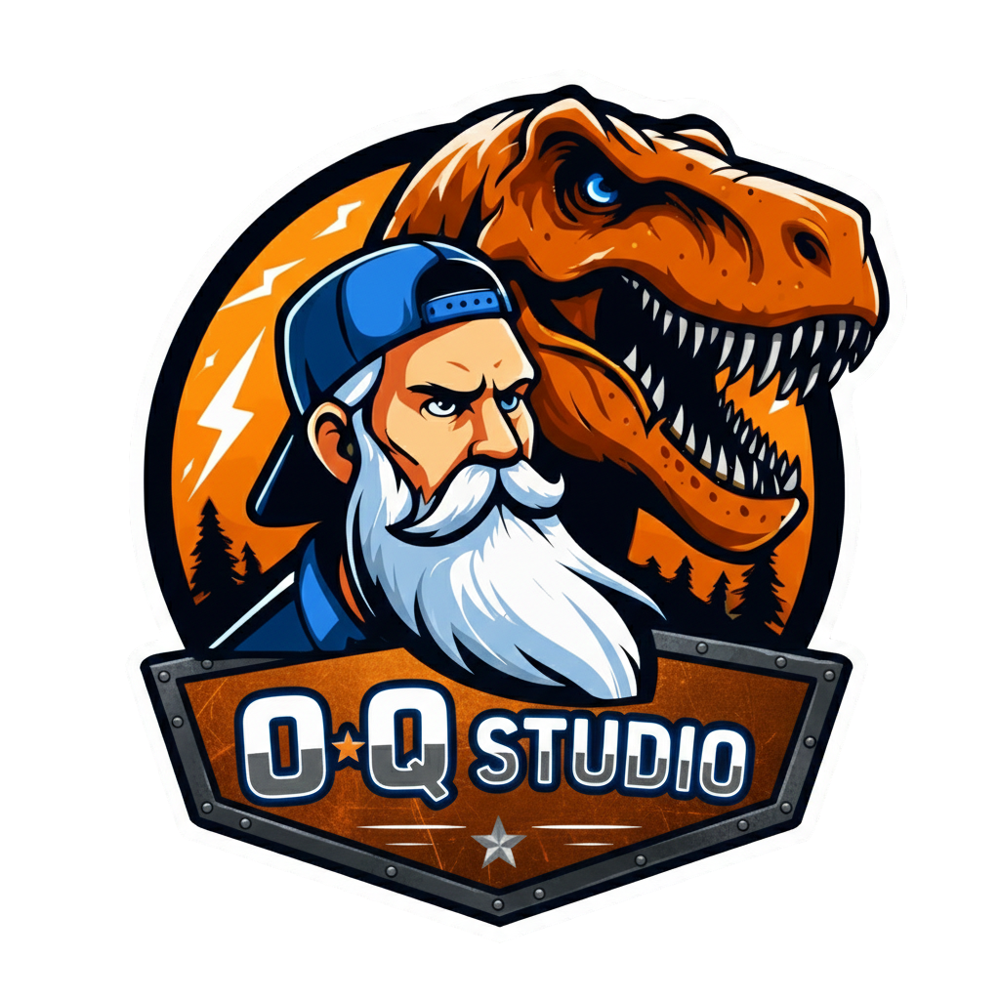

# AutoCollision & Navmesh Ultimate for Godot 4.x

  

**AutoCollision & Navmesh Ultimate** is a powerful Blender addon designed specifically for **Godot 4.x** developers. It automates the tedious process of setting up physics bodies and navigation meshes, ensuring a seamless bridge between Blender and Godot without the common headache of broken hierarchies or naming conflicts.

---

## 💥 Key Features

### 1. Automatic Collisions
Generate collision shapes instantly using Godot's native naming conventions (`-col` or `-colonly`).
* **Smart Hierarchy:** Collisions are automatically parented to your meshes.
* **Auto-Cleanup:** The addon detects and removes old collision shapes (including annoying `.001` duplicates) before creating new ones.
* **3 Detail Levels:**
    * **Bounding Box:** Fastest, optimized box collisions.
    * **Convex Hull:** Fitted shapes for irregular objects.
    * **Exact Copy:** Precise 1:1 mesh data for complex geometry.

### 2. Intelligent Navmesh Generation
Stop fighting with "jumping objects" when grouping meshes for navigation.
* **Nuclear Stability:** Uses a smart *World Space Reset* algorithm to ensure your objects **never shift coordinates** when being grouped into a Navmesh.
* **Auto-Heal:** If you remove an object from a Navmesh group, the addon automatically recalculates the remaining Navmesh to fit the current setup.
* **Geometry Control:** Adjust *Max Slope*, *Lift (Offset)*, and *Simplify (Decimation)* directly from the UI panel.

---

## 📺 Video Demo

Watch the addon in action and see the workflow improvements:

---

## 🔧 Installation

1. Download the repository as a **.zip** file.
2. In Blender, go to `Edit > Preferences > Add-ons`.
3. Click **Install...** and select the downloaded file.
4. Enable the checkbox for **AutoCollision & Navmesh Ultimate**.
5. Find the panel in the **View3D > Sidebar (N) > Collisions**.

---

## 🛠️ Support & Bug Reports

Found a bug or have a feature request? Please let us know!
👉 [Submit an Issue](https://github.com/oqstudio/AutoCollision-Blender-to-Godot/issues)

---

## 🔗 Links

* **GitHub Repository:** [https://github.com/oqstudio/AutoCollision-Blender-to-Godot](https://github.com/oqstudio/AutoCollision-Blender-to-Godot)
* **Official Website:** [https://oqstudio.pl](https://oqstudio.pl)

---

  
   
  Developed with passion by <b>OQ Studio</b> for the Godot Community.

